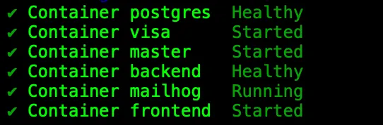
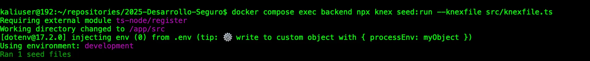
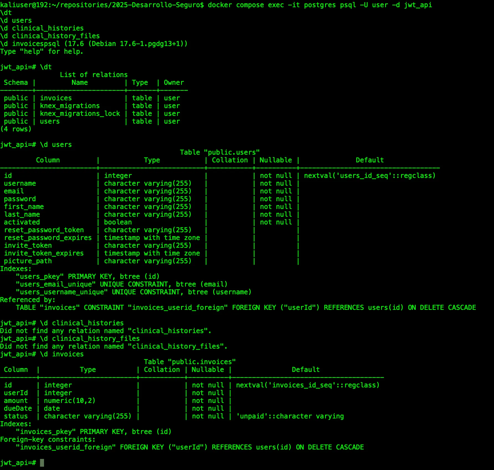

# Inicio rápido (Docker)

1. Construir y levantar servicios

```bash
docker compose -f "docker-compose.yaml" up -d --build
```



1. Seed de datos (dentro del contenedor backend)

```bash
docker compose exec backend npx knex seed:run --knexfile src/knexfile.ts
```



1. Accesos
- Frontend: `http://localhost:3000`
- Backend: `http://localhost:5000`
- Swagger UI: `http://localhost:5000/api-docs`
- Mailhog (SMTP de pruebas): `http://localhost:8025`

1. **Verificación de base de datos (Postgres)**

Conectarse al contenedor y listar tablas:

```bash
docker compose exec -it postgres psql -U user -d jwt_api
\dt
\d users
\d clinical_histories
\d clinical_history_files
\d invoices
```

Salir con `\q`.

Atajos desde host:

```bash
docker compose exec postgres psql -U user -d jwt_api -c "\dt"
docker compose exec postgres psql -U user -d jwt_api -c "SELECT table_name FROM information_schema.tables WHERE table_schema='public';"
```

