# Vulnerabilidades

## **Inyección SQL (SQLi)**

### Identificar

Código encontrado en el backend: `services/backend/src/services/invoiceService.ts`

```tsx
class InvoiceService {
  static async list( userId: string, status?: string, operator?: string): Promise<Invoice[]> {
    let q = db<InvoiceRow>('invoices').where({ userId: userId });
    if (status) q = q.andWhereRaw(" status "+ operator + " '"+ status +"'");
    const rows = await q.select();
    const invoices = rows.map(row => ({
      id: row.id,
      userId: row.userId,
      amount: row.amount,
      dueDate: row.dueDate,
      status: row.status} as Invoice
    ));
    return invoices;
  }
```

**Error:**

- Se están concatenando dos inputs en SQL crudo: operator y status

### Validar

El método  `list` es es usado en `services/backend/src/controllers/invoiceController.ts`  desde `listInvoices`

```tsx
const listInvoices = async (req: Request, res: Response, next: NextFunction) => {
  try {
    const state = req.query.status as string | undefined;
    const operator = req.query.operator as string | undefined;
    const id   = (req as any).user!.id; 
    const invoices = await InvoiceService.list(id, state,operator);
    res.json(invoices);
  } catch (err) {
    next(err);
  }
};
```

`listInvoices` esta referenciado en `services/backend/src/routes/invoices.routes.ts` como parte de la raiz de `/invoices`

```tsx
import routes from '../controllers/invoiceController';
// GET /invoices
router.get('/', routes.listInvoices);
```

`/invoices` esta indicado ya desde el `services/backend/src/index.ts`

```bash
import invoiceRoutes from './routes/invoices.routes';
app.use('/invoices', invoiceRoutes);
```

Entonces podemos usar CURL con la URL de backend, más el path `/invoices`, más los parámetros, sin olvidarnos del TOKEN:

```bash

curl -i 
"http://localhost:5000/invoices?
userId=<userID>&
operator=<operador>&
status=<status>"\
-H "Authorization: Bearer $TOKEN"
```

Ejemplo que podemos ejecutar

```bash

curl -i "http://localhost:5000/invoices?userId=123&operator=%3D&status=paid'%20OR%20'1'%3D'1'--%20" \
  -H "Authorization: Bearer $TOKEN"

```

Donde el código vulnerable era:

```bash
.andWhereRaw(" status " + operator + " '" + status + "'");
```

Usamos los siguientes parámetros:

- `operator = =` para que no lo tome en cuenta
- `status = 'paid'` era la condición original.
- `OR '1'='1'` siempre es verdadero.
- `--`  en SQL es un comentario, por lo tanto ignora el resto de la línea.

Por consiguiente, ya que en SQL `AND` tiene mayor precedencia que `OR`, el WHERE sera algo como:

```bash
WHERE ( userId = '123' AND status = 'paid' ) OR ( '1'='1' )
```

Toda la condición es verdadera para todas las filas, brindando todas las facturas del sistema:

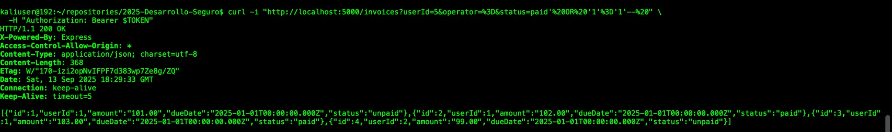

Nota: podemos verificar esa información consultándola directamente a la base de datos:

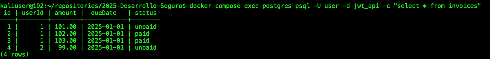

### Remediar

Sustituir el código:

```tsx
  static async list( userId: string, status?: string, operator?: string): Promise<Invoice[]> {
    let q = db<InvoiceRow>('invoices').where({ userId: userId });
    if (status) q = q.andWhereRaw(" status "+ operator + " '"+ status +"'");
    const rows = await q.select();
    const invoices = rows.map(row => ({
      id: row.id,
      userId: row.userId,
      amount: row.amount,
      dueDate: row.dueDate,
      status: row.status} as Invoice
    ));
    return invoices;
  }
```

por el siguiente:

```tsx
  // Modificado en PRACTICO 02
  static async list(userId: string, status?: string, operator?: string): Promise<Invoice[]> {
    let q = db<InvoiceRow>('invoices').where({ userId });

    if (status) {
      // Validar status contra un conjunto permitido (seria correcto validarlo con una tabla de estados en la BD)
      const allowedStatus = new Set(['paid', 'unpaid']);
      if (!allowedStatus.has(status)) {
        throw new Error('Invalid status');
      }

      // Whitelist de operadores (si realmente hace falta)
      // Para un campo de texto "status", típicamente solo "=" o "!=" tienen sentido.
      const op = operator ?? '=';
      switch (op) {
        case '=':
          q = q.andWhere('status', status);
          break;
        case '!=':
          q = q.andWhereNot('status', status);
          break;
        default:
          throw new Error('Invalid operator');
      }
    }
```

### Verificar

Volvemos a correr:

```bash

curl -i "http://localhost:5000/invoices?userId=123&operator=%3D&status=paid'%20OR%20'1'%3D'1'--%20" \
  -H "Authorization: Bearer $TOKEN"
```

y nos devuelve el error que agregamos para cuando el `status` no corresponde

```bash
{"message":"Invalid status"}
```

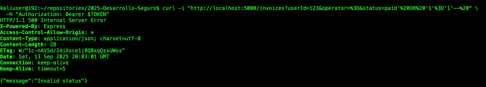


# CREDENCIALES EMBEBIDAS (BELEN)

# FALSIFICACIÒN DE PETICIONES DEL LADO DEL SERVIDOR (BELEN)


---

## RECORRIDO DE DIRECTORIOS (CWE-22)

### **Identificar**

Còdigo encontrado en el backend: `services/backend/src/services/invoiceService.ts`

```tsx
  static async getReceipt(
    invoiceId: string,
    pdfName: string
  ) {
    // check if the invoice exists
    const invoice = await db<InvoiceRow>('invoices').where({ id: invoiceId}).first();
    if (!invoice) {
      throw new Error('Invoice not found');
    }
    try {
      const filePath = `/invoices/${pdfName}`;
      const content = await fs.readFile(filePath, 'utf-8');
      return content;
    } catch (error) {
      // send the error to the standard output
      console.error('Error reading receipt file:', error);
      throw new Error('Receipt not found');

    } 

  };
```

Este còdigo es vulnerable a Path traversal, ya que las lìneas:
```tsx
  const filePath = `/invoices/${pdfName}`;
  const content = await fs.readFile(filePath, 'utf-8');
  return content;
```

la variable `filePath` está armando la ruta de la `url` pegando direcramente lo que viene del usuario (`pdfName`) al directorio `/invoices`, y luego lo abre con `fs.readFile` sin verificar nada antes.
Esto significa que si alguien envía `pdfName` con rutas relativas como `../`, la ruta que se manda podría salir del directorio `/invoices` y apuntar a archivos que estén afuera que el proceso pueda leer, por lo que trataría de un Path Traversal.

### Validar

#### Introducción
Para reproducir la vulnerabilidad Path Traversal en `getReceipt`, crearemos un archivo `.txt` de prueba dentro del contenedor backend y luego intentaremos leerlo a través del endpoint de facturas usando el parámetro `pdfName` (`GET /invoices/{id}/invoice?pdfName=...`) usando un payload que salga del directorio `/invoices` .

Si la respuesta devuelve el contenido del archivo `.txt` de prueba creado, se podrá confirmar que la aplicación construye rutas a partir de datos controlados por el usuario sin normalizarlas ni validarlas, por lo que estaremos frente a un caso de Path Traversal.

#### Paso1: Creamos el archivo de prueba .txt
Creamos el archivo `archivoEncontrado.txt` dentro del contenedor backend:
```bash
  docker compose exec backend sh -c "mkdir -p /tmp/poc_test_dir && echo 'llegaste a la vulnerabilidad' > /tmp/poc_test_dir/archivoEncontrado.txt && cat /tmp/poc_test_dir/archivoEncontrado.txt"
```


#### Paso 2: Calculamos la ruta relativa del archivo
Calculamos la ruta relativa que hay desde `/invoices` hasta el archivo que tendremos como objetivo `/tmp/carpetaPOC/archivoEncontrado.txt`  usando  `path.relative`, para poder utilizar en el endpoint de consulta de facturas que se pasará como `pdfName`.

```bash
  docker compose exec backend node -e "const path=require('path'); console.log(path.relative(process.argv[1], process.argv[2]));" "/invoices" "/tmp/carpetaPOC/archivoEncontrado.tx
```


## Almacenamiento inseguro (CWE-256)

### **Identificar**

En `services/backend/src/services/authService.ts` se encuentra el siguiente código, eso implica que en la Base de Datos la columna users.password guarda texto plano (o algo reversible).

```tsx
  static async authenticate(username: string, password: string) {
    const user = await db<UserRow>('users')
      .where({ username })
      .andWhere('activated', true)
      .first();
    if (!user) throw new Error('Invalid email or not activated');
    if (password != user.password) throw new Error('Invalid password');
    return user;
  }
```

1. Busca un usuario en la tabla users con ese username y activated = true.
2. Si no encuentra, devuelve error.
3. Si lo encuentra, compara directamente el password recibido con lo que está guardado en la base.
4. Si coincide, devuelve el usuario.

Problemas:

- Manejo de contraseñas en texto plano.
    - Se está guardando user.password tal cual en la base.
- Se compara con if (password != user.password) en lugar de usar un hash.
- O sea que permite que si alguien accede a la base, vea todas las contraseñas.

### Validar

Ver los datos insertados en la base de datos

```sql
SELECT username, password FROM users;
```

Podemos ejecutar directamente en la consola:

```bash
docker compose exec postgres psql -U user -d jwt_api -c "SELECT username, password FROM users;"
```

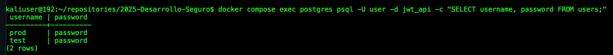

### Remediar

Implementar el uso de `bcrypt` con un factor de `costo configurado en 12` para el almacenamiento de contraseñas. Esto permite que cada contraseña se guarde como un hash irreversible con una `sal` única generada automáticamente, impidiendo que dos usuarios con la misma contraseña tengan el mismo valor en la base de datos, así como dificultar los ataques de fuerza bruta. 

También incorporar el uso de una variable `pepper`, otro valor secreto que se concatena con la contraseña antes de hashearla, que diferencia del salt, no se almacena en la base de datos, sino en un entorno seguro, como una variable de entorno.

En el proceso de autenticación se reemplaza la comparación directa de contraseñas por `bcrypt.compare`, garantizando verificaciones seguras y resistentes a ataques de temporización. 

Por último, con fines de facilitar la conversión de contraseña desde texto plano a hasheada, se agrega funcionalidad `LEGACY_PW_MIGRATION` para verificar si la contraseña aun esta en texto plano, y conviertirla automáticamente.

Cambios aplicados en `services/backend/src/services/authService.ts`:

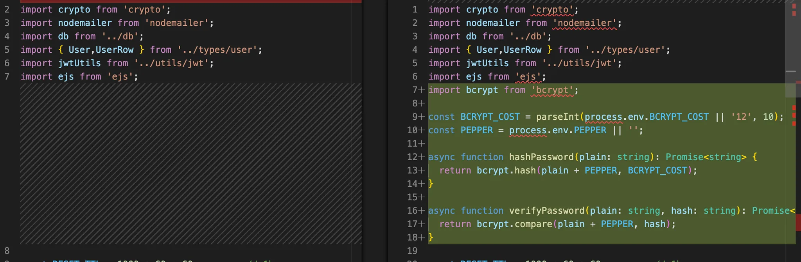

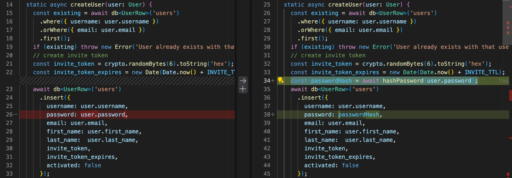

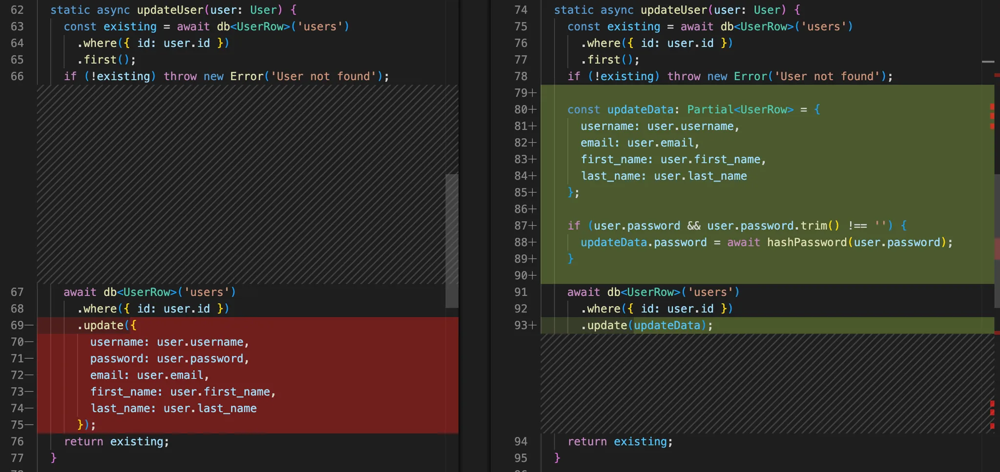

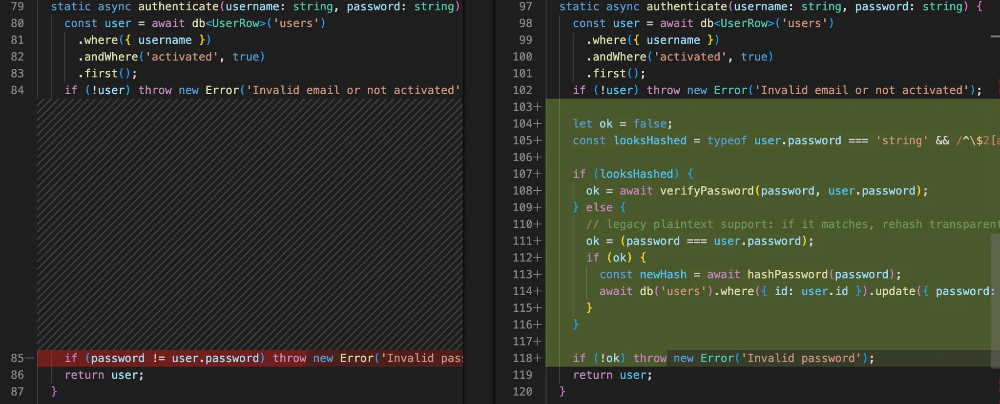

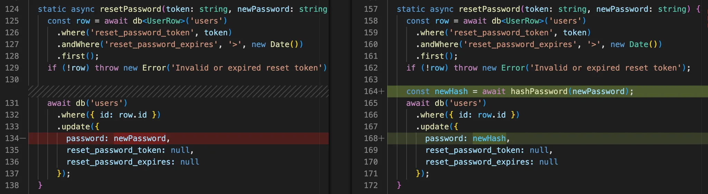

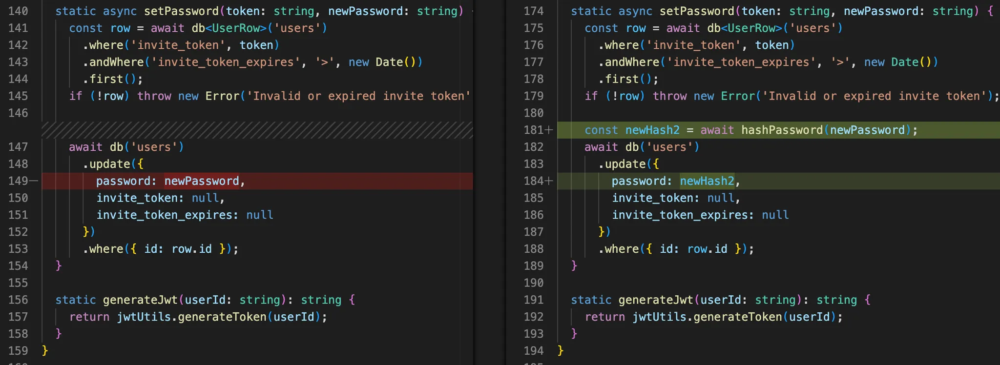

Si bien la funcionalidad `LEGACY_PW_MIGRATION`no introduce una nueva vulnerabilidad por sí misma (ya que si la base de datos contenía contraseñas en texto plano y si el atacante ya leyó la esta información, podrá autenticarse con o sin migración. De todas formas se agrega una bandera para desactivar esta funcionalidad.

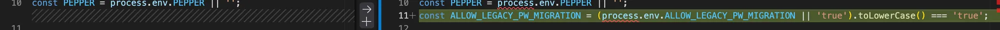

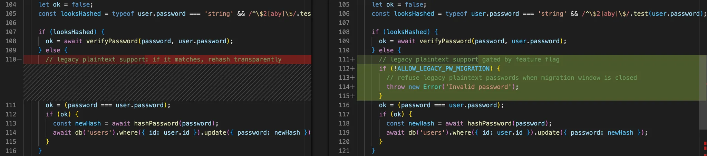

### Verificar

Accedemos como lo haciamos desde el inicio

```bash
curl -s -X POST http://localhost:5000/auth/login \
  -H "Content-Type: application/json" \
  -d '{"username":"test","password":"password"}'
```

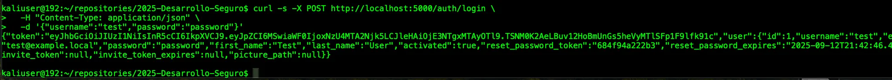

Comprobamos si la contraseña de ese usuario se a convertido de texto plano a hash en la base de datos

```bash
docker compose exec postgres psql -U user -d jwt_api -c "SELECT username, password FROM users;"
```

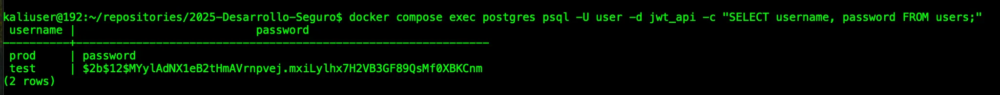

Volvemos a logueranos de la misma forma

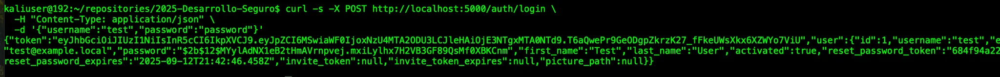

Y ya podemos confirmar que en este nuevo intento, la contraseña ya no es en texto plano tampoco la información devuelta por el backend (independiémente de si devolver ese valor es una buena práctica o no).

